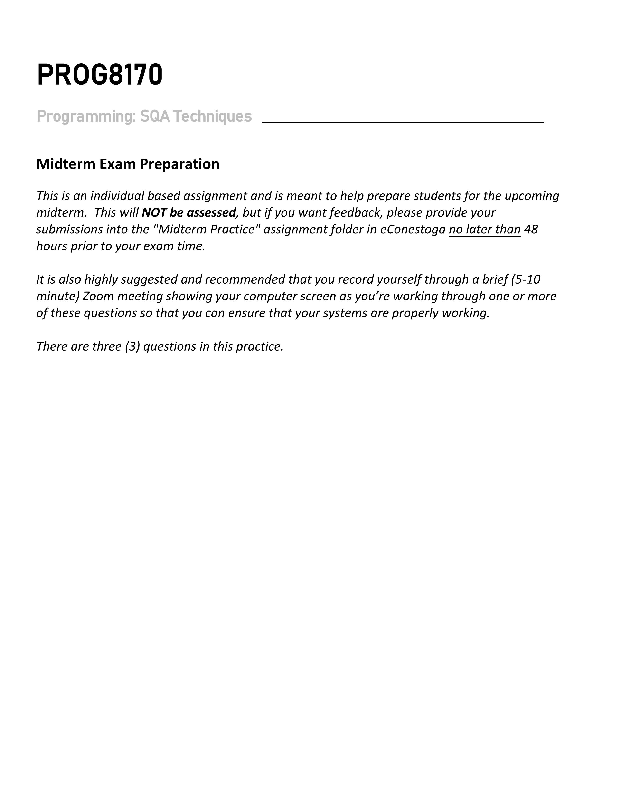
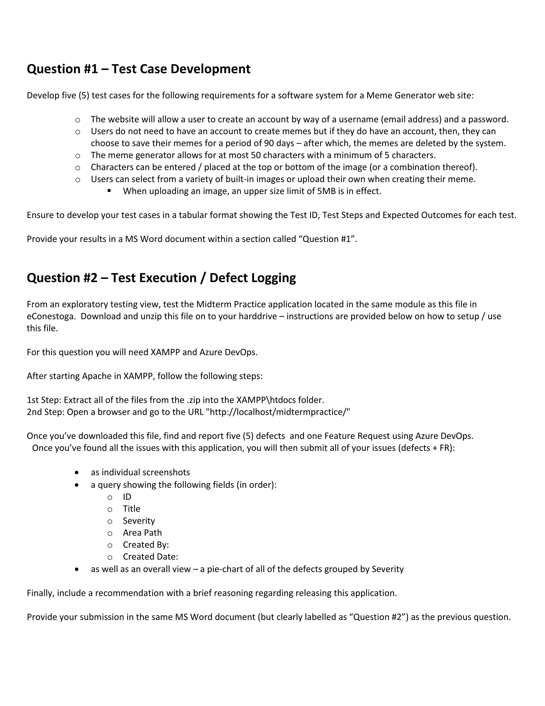
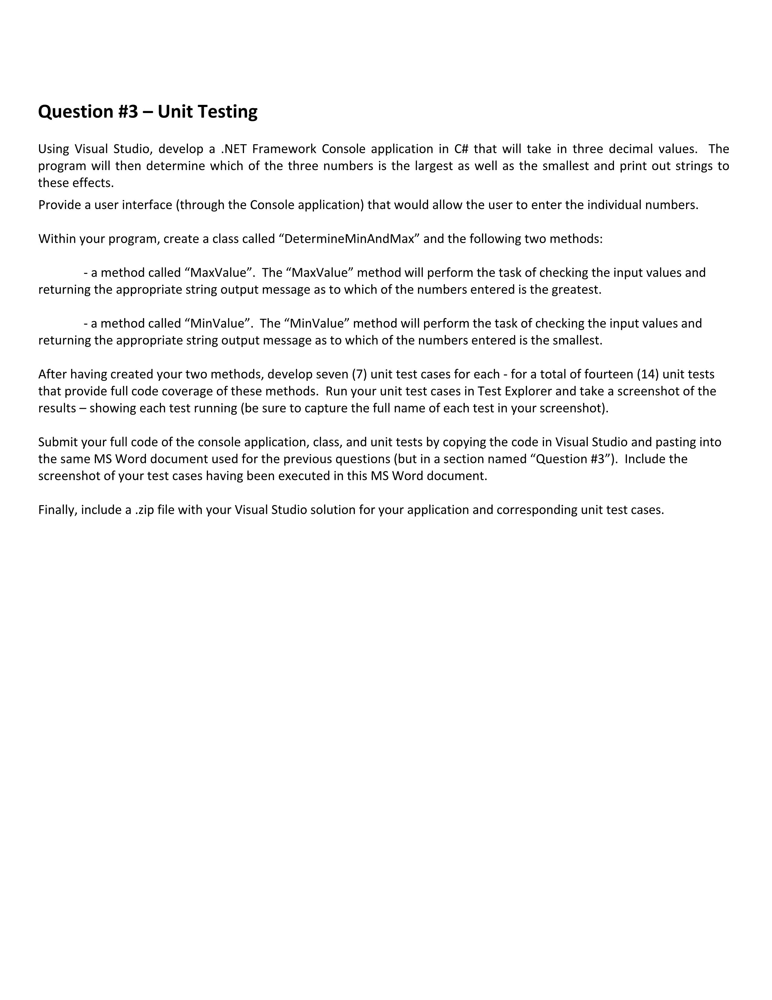
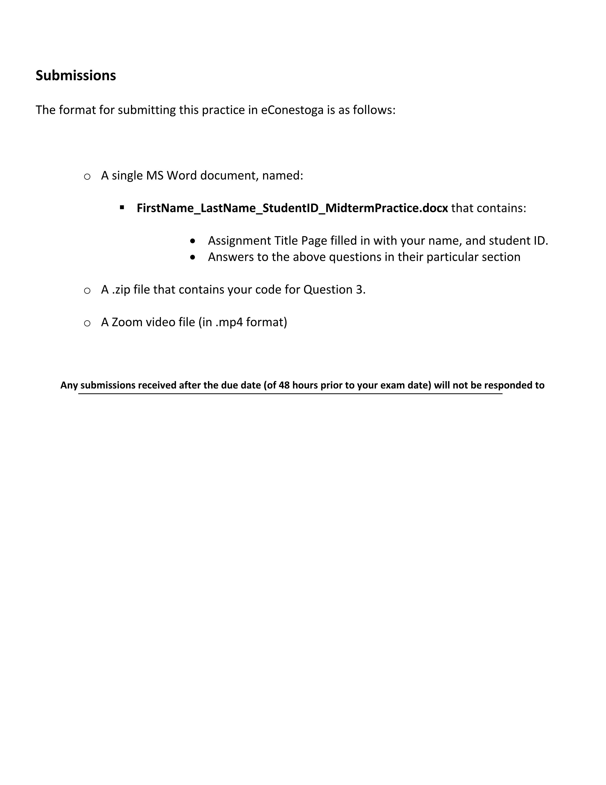

# PROG8170-23S-Sec1-Software-Quality-Assurance-Midterm-Practice

The midterm practice of Conestoga College PROG8170-23S-Sec1 consists of Three Parts: Test Case Development, Test Execution / Defect Logging and Unit Testing. It's the prework of midterm exam.

## Requirements

## Question 1 Table

[TestCase.xlsx](./doc/TestCase.xlsx)

## Question 2 Project Address

[https://dev.azure.com/Sliu9412/MidtermPrework/_workitems/recentlyupdated/](https://dev.azure.com/Sliu9412/MidtermPrework/_workitems/recentlyupdated/)

## Doc

[Siyu_Liu_8859412_MidtermPractice.docx](./doc/Siyu_Liu_8859412_MidtermPractice.docx)
